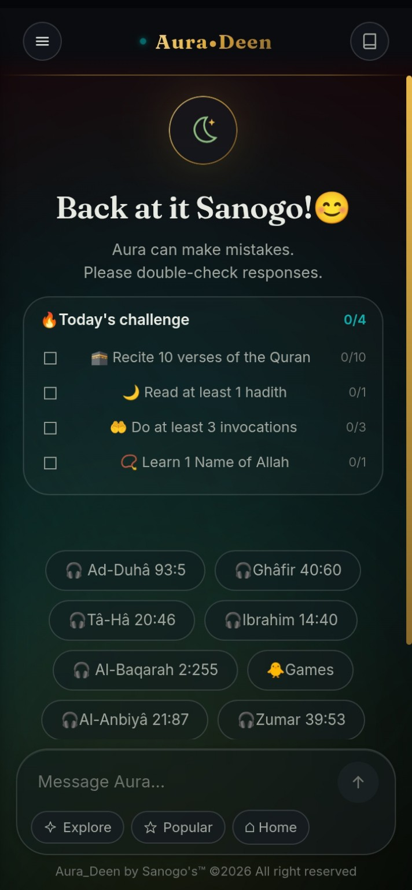

<div align="center">

# 🌿 Aura · Deen

### Lire · Écouter · Mémoriser · Progresser

**Une application web pour lire, écouter et mémoriser le Coran — avec hadiths, invocations, prêches et les 99 Noms d'Allah réunis dans une même expérience, 100 % locale et sans backend.**

<p>
<a href="https://chacoul31.github.io/Aura-deen/">🌐 Démo</a> •
<a href="https://github.com/Chacoul31/Aura-deen/stargazers">⭐ Star</a> •
<a href="https://github.com/Chacoul31/Aura-deen/issues">🐛 Issues</a> •
<a href="https://github.com/Chacoul31/Aura-deen/discussions">💬 Discussions</a>
</p>



</div>

---

## ✨ À propos

**Aura · Deen** est une application web open source qui réunit plusieurs ressources islamiques dans une seule interface : Coran, hadiths, invocations, prêches audio et les 99 Noms d'Allah — avec un vrai système de **mémorisation par répétition espacée**, une progression suivie au fil de la lecture, et une personnalisation poussée de l'affichage.

Le tout fonctionne **sans serveur** : un simple fichier `index.html` hébergé sur GitHub Pages, installable comme une application (PWA), utilisable hors ligne une fois les contenus mis en cache.

> 🌿 **Une interface moderne. Des sources respectées. Une expérience pensée pour l'utilisateur.**

---

## 🌙 Fonctionnalités

### 📖 Coran
- 114 sourates — texte arabe, translittération, traduction française
- Lecture audio verset par verset, écoute continue par sourate
- Option de récitation en français après l'arabe (activable dans les paramètres)
- Répétition programmable d'un verset (1 / 5 / 10 / 20 fois)
- Recherche par mot-clé, thème, ou référence directe (ex. `2:255`)
- Suivi de progression par sourate et globale, reprise automatique de la dernière lecture

### 📚 Hadiths
- 9 recueils : Sahih Muslim, Sahih Al-Boukhari, Abou Dawoud, Ibn Majah, Mouwatta Malik, An-Nassa'i, 40 hadiths de an-Nawawi, 40 hadiths qudsi, 40 hadiths de Dehlawi
- Navigation par recueil puis par livre, ou recherche libre dans le chat
- Recherche par numéro de hadith ou par thème

### 🤲 Invocations
- Plus d'une centaine d'invocations, classées par catégorie, avec leur source
- Présentation compacte (liste de pastilles) — le détail s'ouvre au clic

### ✨ Les 99 Noms d'Allah
- Nom, translittération, sens, description et bienfait pour chacun
- Lecture audio individuelle, recherche par nom

### 🕌 Prêches
- Bibliothèque de prêches audio classés par thème (Sira, prophètes, compagnons, croyance, fin des temps, vie pratique...)
- Recherche par mot-clé ou par catégorie

### 🧠 Mémorisation (méthode 20/20)
- Choix d'une portion (1 à 5 versets), session de 20 lectures + 20 récitations avec texte masqué
- Planification automatique des révisions (le jour même, le lendemain, puis intervalles croissants)
- Niveaux de maîtrise automatiques : 🔴 Nouveau → 🟠 En apprentissage → 🟡 Consolidation → 🟢 Maîtrisé
- Page dédiée **Mes révisions** avec révision combinée de tous les passages dus
- Objectifs quotidiens et hebdomadaires de révision

### 🎯 Objectifs & progression
- Objectifs quotidiens personnalisables (versets, hadiths, invocations, Noms d'Allah)
- Profil avec statistiques : série de jours consécutifs, versets lus, sourates consultées, contenus étudiés
- Favoris sur les versets et hadiths, avec copie et partage natif

### 🎮 Apprentissage ludique
- Quiz « Devine la sourate » à partir d'un verset

### ⚙️ Personnalisation
- Taille du texte, police, réduction des animations, translittération affichée ou non
- Couleur d'accent personnalisable
- Export / import de toutes les données en un fichier `.json` (sauvegarde et changement d'appareil)

---

## 🔎 Une recherche pensée pour retrouver le bon contenu

Aura · Deen permet d'explorer les contenus à partir de plusieurs approches :

- 🔤 mots-clés
- 📖 sourate (nom, numéro, ou synonyme courant, avec tolérance aux fautes de frappe)
- 🔢 référence directe (`2:255`, `hadith n°12`...)
- 🏷️ thème (patience, pardon, prière, fin des temps...)
- 📚 recueil ou catégorie

L'objectif est de **retrouver des contenus existants avec leur référence exacte**, jamais de fabriquer une réponse religieuse.

---

## 🧠 Une approche différente de l'IA

Aura · Deen n'utilise **aucun modèle génératif** pour répondre aux questions religieuses. Le moteur conversationnel est entièrement **fondé sur des données** : chaque réponse provient d'un texte réel (verset, hadith, invocation) avec sa référence, ou d'un contenu rédigé et validé à l'avance.

> **Les versets, hadiths, invocations et citations religieuses ne sont jamais inventés ni générés — uniquement retrouvés dans des sources identifiées.**

Pour les questions de jurisprudence (fiqh), l'application ne se présente pas comme une autorité religieuse et encourage à consulter un savant.

---

## 🔒 Confidentialité d'abord

- Toutes les données (progression, favoris, mémorisation, objectifs, statistiques, préférences) restent **uniquement dans le navigateur** (`localStorage`), rien n'est envoyé à un serveur
- Aucune création de compte nécessaire
- Export manuel possible à tout moment pour sauvegarder ou transférer ses données

> **Ton expérience et tes données t'appartiennent — rien n'est collecté.**

---

## 📱 Pensé pour le mobile

- Interface sombre, effet verre dépoli (glassmorphism)
- Navigation tactile, menu unique accessible en un geste
- Installable comme application (PWA) sur écran d'accueil
- Mise en cache automatique des contenus déjà écoutés pour une utilisation hors ligne
- Interface responsive, personnalisation de l'affichage

---

## 🛠️ Technologies

| Technologie | Utilisation |
|---|---|
| HTML5 | Structure de l'application (fichier unique) |
| CSS3 | Interface, glassmorphism, responsive design |
| JavaScript (vanilla) | Logique, moteur de recherche, mémorisation |
| JSON | Données locales (Coran, hadiths, invocations, Noms, prêches) |
| Web Audio | Lecture et mise en cache audio |
| LocalStorage | Préférences, progression, favoris, mémorisation |
| Service Worker / PWA | Installation et fonctionnement hors ligne |

---

## 🚀 Utilisation

### 🌐 En ligne

**[Ouvrir Aura · Deen](https://chacoul31.github.io/Aura-deen/)**

### 💻 Installation locale

```bash
git clone https://github.com/Chacoul31/Aura-deen.git
cd Aura-deen
```

Ouvrez `index.html` dans un navigateur, ou servez le dossier avec un serveur local (ex. `python -m http.server`) pour que le chargement des données JSON fonctionne correctement.

---

## 📂 Structure

```text
Aura-deen/
│
├── index.html              # Application complète (interface + logique)
├── manifest.json           # Manifeste PWA
├── sw.js                   # Service worker (cache hors ligne)
│
├── data/
│   ├── chapter.json        # Métadonnées des 114 sourates
│   ├── quran.json          # Texte arabe
│   ├── fr.json              # Traduction française
│   ├── transliteration.json
│   ├── hadith-muslim.json  # + bukhari.json, abudawud.json, ibnmajah.json,
│   │                        #   malik.json, nasai.json, nawawi.json, qudsi.json, dehlawi.json
│   ├── invocations.json
│   └── names.json          # Les 99 Noms d'Allah
│
├── audio/
│   ├── 001/ … 114/          # Récitation arabe, verset par verset
│   ├── duas/                # Audio des invocations (optionnel)
│   ├── names/                # Audio des 99 Noms
│   └── preches/              # Prêches audio
│
├── Coran/
│   └── 001/ … 114/           # Récitation française (optionnelle)
│
├── icons/                   # Icônes PWA
├── assets/                  # Images du dépôt (captures, logo)
│
├── README.md
├── LICENSE
├── CODE_OF_CONDUCT.md
├── CONTRIBUTING.md
├── SECURITY.md
├── ROADMAP.md
├── CHANGELOG.md
└── ACKNOWLEDGMENTS.md
```

---

## 🤝 Contribuer

Aura · Deen est un projet **open source**. Vous pouvez contribuer en :

- 💻 développant une fonctionnalité
- 🐛 corrigeant un bug
- 🎨 améliorant l'interface
- ⚡ optimisant les performances
- ♿ améliorant l'accessibilité
- 📚 améliorant la documentation
- 🔎 vérifiant une référence religieuse
- 💡 proposant une idée
- 🧪 testant l'application

Avant de contribuer, consultez [`CONTRIBUTING.md`](CONTRIBUTING.md), [`CODE_OF_CONDUCT.md`](CODE_OF_CONDUCT.md) et [`SECURITY.md`](SECURITY.md).

---

## 🗺️ Roadmap

- [ ] 🔔 Rappels de révision (notifications)
- [ ] 🔎 Recherche tolérante aux fautes de frappe sur tous les recueils de hadiths
- [ ] 📊 Visualisation de la régularité des révisions
- [ ] 👆 Navigation par balayage entre versets et sourates
- [ ] 🌍 Support de nouvelles langues
- [ ] ♿ Accessibilité renforcée
- [ ] 🤝 Développement de la communauté open source

Voir [`ROADMAP.md`](ROADMAP.md).

---

## 📜 Licence

Le **code original** d'Aura · Deen est distribué sous licence **MIT**. Voir [`LICENSE`](LICENSE).

### ⚠️ Contenus tiers

La licence MIT ne couvre pas l'ensemble des contenus du dépôt. Les traductions, textes, hadiths, fichiers audio, images, données, polices, bibliothèques et ressources externes peuvent avoir leurs propres licences. Voir [`ACKNOWLEDGMENTS.md`](ACKNOWLEDGMENTS.md).

---

## 🙏 Remerciements

Merci aux auteurs, contributeurs et communautés qui rendent possible le partage de ressources islamiques accessibles, ainsi qu'à toutes les personnes qui testent Aura · Deen, signalent des problèmes et proposent des idées.

---

<div align="center">

## 🌿 Aura · Deen

**Lire · Écouter · Mémoriser · Progresser**

Made with ❤️ by **Sanogo**

**© 2026 Aura · Deen**

</div>
